<p align="center">
  
</p>

<h1 align="center">StatzHub – Full-Stack Trading Platform</h1>

<p align="center">
  
</p>

<p align="center"><strong>Orbit</strong> — Your personal trading dashboard inside StatzHub.</p>

---

# 📘 **Project Overview**

**StatzHub** is a full-stack MERN trading & investment tracking platform inspired by **Zerodha (Kite)**.  
It is divided into two major parts:

### **1️⃣ Frontend – Marketing Website** (`/frontend`)

A modern website similar to Zerodha.com containing:

- Home
- Products
- Pricing
- Signup / Login
- About (Company & Creator)
- Support (ticket UI)

### **2️⃣ Orbit Dashboard – User Trading App** (`/dashboard`)

A complete simulation of a trading dashboard:

- Watchlist
- Holdings
- Positions
- Orders
- Dashboard summary
- Interactive charts
- Logout system

### **3️⃣ Backend** (`/backend`)

Secure Node.js + Express backend with:

- JWT authentication
- MongoDB Atlas storage
- Protected routes
- User/Orders/Holdings/Positions schemas

This project is built for **learning, portfolio demonstration, and interview showcase**.

---

# 🧰 **Tech Stack**


| Layer                       | Technologies                        |
| --------------------------- | ----------------------------------- |
| **Frontend Marketing Site** | React, React Router, CSS, Bootstrap |
| **Dashboard App**           | React, Chart.js, Context API        |
| **Backend**                 | Node.js, Express.js                 |
| **Database**                | MongoDB Atlas                       |
| **Auth**                    | JWT-based Authentication            |
| **Charts**                  | react-chartjs-2 (Chart.js wrapper)  |

---

# 🏗️ **Full System Architecture**

```mermaid
flowchart TD

User[[User Browser]] --> F1[Frontend • React Marketing Site]

User --> D1[Dashboard App • React]

F1 --> BE[Backend • Node.js / Express]
D1 --> BE

BE --> DB[(MongoDB Atlas)]

D1 --> Charts[Chart.js Visualizations]
```



---

# 🔐 **JWT Authentication Workflow**


---

# 📂 **Folder Structure**

```
StatzHub/
│
├── backend/
│   ├── middleware/
│   │   └── authMiddleware.js
│   ├── model/
│   │   ├── HoldingsModel.js
│   │   ├── OrdersModel.js
│   │   ├── PositionsModel.js
│   │   └── UserModel.js
│   ├── routes/
│   │   ├── authRoutes.js
│   │   └── userRoutes.js
│   ├── schemas/
│   │   ├── HoldingsSchema.js
│   │   ├── OrdersSchema.js
│   │   ├── PositionsSchema.js
│   │   └── UserSchema.js
│   ├── index.js
│   └── .env
│
├── dashboard/
│   ├── public/
│   │   ├── index.html
│   │   └── logo.jpg
│   ├── src/
│   │   ├── components/
│   │   │   ├── Apps.js
│   │   │   ├── Dashboard.js
│   │   │   ├── WatchList.js
│   │   │   ├── Orders.js
│   │   │   ├── Positions.js
│   │   │   ├── Holdings.js
│   │   │   ├── Summary.js
│   │   │   ├── BuyActionWindow.js
│   │   │   └── SellActionWindow.js
│   │   ├── charts/
│   │   │   ├── DoughnutChart.js
│   │   │   ├── VerticalGraph.js
│   │   │   └── TopBar.js
│   │   ├── context/
│   │   │   └── AuthContext.js
│   │   ├── data/
│   │   │   └── data.js
│   │   ├── ProtectedRoute.js
│   │   └── index.js
│
├── frontend/
│   ├── public/
│   │   └── media/images/*
│   ├── src/
│   │   ├── landing_page/
│   │   │   ├── home/
│   │   │   ├── pricing/
│   │   │   ├── products/
│   │   │   ├── signup/
│   │   │   ├── support/
│   │   │   └── about/
│   │   ├── context/
│   │   │   └── AuthContext.js
│   │   ├── Navbar.js
│   │   ├── Footer.js
│   │   └── App.js
│
└── package.json
```

---

# 🚀 **StatzHub User Flow**

### Step 1: Frontend Marketing & Account Management

- **Action:** User lands on the main **`frontend`** site, handled by `frontend/src/App.js`.
- **Navigation:** User interacts with pages within **`frontend/src/landing_page/`**:
  - `home/`
  - `products/`
  - `pricing/`
  - `about/`
  - `support/`
- **Authentication:** User accesses sign-up or login routes within **`frontend/src/landing_page/signup/`**.
  - Authentication logic likely utilizes `frontend/src/context/AuthContext.js`.
  - Requests are sent to **`backend/routes/authRoutes.js`**.
  - User data is managed via **`backend/model/UserModel.js`** and **`backend/schemas/UserSchema.js`**.

---

### Step 2: Post-Login Redirection

- **Authentication Success:** Upon successful login via the backend, the user's session is secured (e.g., with a token validated by **`backend/middleware/authMiddleware.js`**).
- **Redirection:** The user is redirected to the main application dashboard at the `/dashboard` route, which is handled by the **`dashboard/`** application.
  - Access is secured using **`dashboard/src/ProtectedRoute.js`** and **`dashboard/src/context/AuthContext.js`**.

---

### Step 3: Dashboard Functionality

- **Main View:** The primary view is rendered by **`dashboard/src/components/Dashboard.js`** and **`dashboard/src/index.js`**.
- **Data Display (Static):** The core components retrieve and display financial data (as a mock/initial data source) from **`dashboard/src/data/data.js`**:
  - **WatchList:** **`dashboard/src/components/WatchList.js`**
  - **Holdings:** **`dashboard/src/components/Holdings.js`** (Mapped to **`backend/model/HoldingsModel.js`**)
  - **Positions:** **`dashboard/src/components/Positions.js`** (Mapped to **`backend/model/PositionsModel.js`**)
  - **Orders:** **`dashboard/src/components/Orders.js`** (Mapped to **`backend/model/OrdersModel.js`**)
  - **Summary:** **`dashboard/src/components/Summary.js`**
- **Charting:** Data visualization is handled by files within **`dashboard/src/charts/`** using Chart.js:
  - **`DoughnutChart.js`**
  - **`VerticalGraph.js`**
- **Actions:**
  - **Buy/Sell:** **`dashboard/src/components/BuyActionWindow.js`** and **`dashboard/src/components/SellActionWindow.js`** (These would typically interact with the backend to place trades).
  - **Logout:** Initiates the logout process, clearing the session and redirecting back to the frontend's login/home page.

---

# ⚙️ **Run the Project Locally**

### Backend Setup

```bash
cd backend
npm install
npm run dev
```

### **Frontend Marketing Website**

```bash
cd frontend
npm install
npm start
```

### **Orbit Dashboard**

```bash
cd dashboard
npm install
npm star
```

---

### 🔮 **Future Improvements**

- Real-time price feed (WebSocket)
- NSE / Upstox API integration
- OHLC candle charts
- Add Funds / Withdraw UI
- Portfolio insights
- M- obile responsive dashboard
- Notification system

---

## 🧱 Environment Variables

Your backend requires the following environment variables to run properly.

Create a `.env` file inside the **/backend** folder with the following:

| Variable Name | Description                                       |
| ------------- | ------------------------------------------------- |
| `MONGO_URI`   | MongoDB Atlas connection string (**required**)    |
| `JWT_SECRET`  | Secret key used to sign JWT tokens (**required**) |
| `PORT`        | Backend server port (default: `3002`)             |

> 🛑 **Important:**
>
> - `.env` is excluded from GitHub via `.gitignore` for security.
> - Use the `.env.example` file as a template for other developers.

## 📝 `.env.example` File Content

This template defines the essential environment variables required for your **`backend`** server configuration.

### MongoDB Connection

```env
MONGO_URI=mongodb+srv://<username>:<password>@cluster.mongodb.net/statzhub
```

### JWT Secret Key

```env
JWT_SECRET=your_jwt_secret_key_here
```

### Backend Server Port

```env
PORT=3002
```

---

### 🔑 **Demo Login Credentials**

For quick access to the Orbit dashboard, you can use the following demo account:

**Username:** demo@statzhub.com  
**Password:** Demo@123

> ⚠️ These credentials belong to a sample user created only for demo/testing.  
> No real financial or personal data is connected.

### 📜 **License**

MIT License © 2025 **StatzHub**

---

## 👨‍💻 Author

**Shubham Dattatray Asole**  
📧 [asoleshubham01@gmail.com](mailto:asoleshubham01@gmail.com)  
🔗 [LinkedIn](https://www.linkedin.com/in/shubham-asole)  
💻 [GitHub](https://github.com/asoleshubham0125)

---

<p align="center">
  <b>⭐ If you like this project, consider giving it a star on GitHub!</b>
  <br/>
  
</p>

---
